# Nest-Admin-Soybean

<div align="center">


[](LICENSE)
[](https://nodejs.org)
[](https://nestjs.com/)
[](https://vuejs.org/)
[-brightgreen)](server/docs/OPTIMIZATION_README.md)
[](server/docs/OPTIMIZATION_README.md)

**基于 Vue3 + NestJS 的现代化企业级后台管理系统**

集成强大的权限管理、多租户架构、请求加密、完善的日志监控

[在线演示](https://www.linlingqin.top/) | [快速开始](#快速开始) | [文档](#文档) | [更新日志](CHANGELOG.md) | [🎯 优化报告](server/docs/OPTIMIZATION_README.md)

**🎮 演示账户**
- 账号：`demo` | 密码：`demo123` | 租户：`000000`
- 权限：仅查看权限（无法修改数据）

</div>

---

> 🎉 **项目已完成全面优化！** 评级从 B+ (80分) 提升至 **A级 (91分)**  
> ✅ 安全性增强 | ⚡ 性能提升60% | 🔒 租户隔离加固 | 📊 完善监控  
> 📖 查看 [完整优化报告](server/docs/OPTIMIZATION_README.md)

---

## ✨ 特性

### 🎯 核心功能
- 🔐 **多租户 SaaS 架构** - 完整的租户隔离与数据安全
- 👥 **RBAC 权限管理** - 基于角色的访问控制，细粒度权限控制
- 🔒 **请求加密** - AES + RSA 混合加密，保护敏感数据传输
- 📊 **系统监控** - Prometheus 指标、健康检查、实时性能监控
- 📝 **操作日志** - 完整的用户操作轨迹记录
- � **演示模式** - 专为演示站点设计的只读账户系统
- �🌐 **国际化** - 支持中文/英文切换
- 🎨 **主题定制** - 多种主题预设，支持深色模式
- 📱 **响应式设计** - 完美适配各种屏幕尺寸

### 🛠️ 技术栈

#### 后端技术
- **框架**: NestJS 10.x - 企业级 Node.js 框架
- **ORM**: Prisma 5.x - 类型安全的现代 ORM
- **数据库**: PostgreSQL - 强大的关系型数据库
- **缓存**: Redis - 高性能缓存与会话存储
- **认证**: JWT + Passport - 安全的身份验证
- **日志**: Pino - 高性能结构化日志
- **调度**: @nestjs/schedule - 定时任务
- **监控**: Prometheus + Terminus - 健康检查与指标采集
- **文档**: Swagger - 自动生成 API 文档

#### 前端技术
- **框架**: Vue 3.x - 渐进式 JavaScript 框架
- **构建工具**: Vite 7.x - 新一代前端构建工具
- **UI 框架**: Naive UI - 轻量级 Vue 3 组件库
- **状态管理**: Pinia - Vue 3 官方状态管理
- **路由**: Vue Router 4 + Elegant Router - 文件路由
- **CSS**: UnoCSS - 原子化 CSS 引擎
- **请求**: Axios - HTTP 客户端
- **类型**: TypeScript - 类型安全

---

## 📐 系统架构

### 整体架构图

```mermaid
graph TB
    subgraph "前端层"
        A[Vue 3 + Vite]
        B[Naive UI]
        C[Pinia Store]
        D[Vue Router]
    end
    
    subgraph "网关层"
        E[Nginx 反向代理]
        F[负载均衡]
    end
    
    subgraph "应用层"
        G[NestJS 应用]
        H[Guards - 守卫层]
        I[Interceptors - 拦截器]
        J[Pipes - 管道]
    end
    
    subgraph "业务层"
        K[系统管理]
        L[权限管理]
        M[租户管理]
        N[监控管理]
    end
    
    subgraph "数据层"
        O[Prisma ORM]
        P[PostgreSQL]
        Q[Redis Cache]
    end
    
    subgraph "外部服务"
        R[OSS 对象存储]
        S[Prometheus 监控]
    end
    
    A --> E
    B --> A
    C --> A
    D --> A
    E --> F
    F --> G
    G --> H
    H --> I
    I --> J
    J --> K
    J --> L
    J --> M
    J --> N
    K --> O
    L --> O
    M --> O
    N --> O
    O --> P
    O --> Q
    G --> R
    G --> S
```



### 多租户架构

```mermaid
graph LR
    A[用户请求] --> B[TenantGuard]
    B --> C[提取 tenantId]
    C --> D[设置租户上下文]
    D --> E[Prisma 扩展]
    E --> F[自动注入租户过滤]
    F --> G[数据隔离查询]
    G --> H[返回租户数据]
```



### 权限控制流程

```mermaid
sequenceDiagram
    participant C as 客户端
    participant G as Guards
    participant A as Auth Service
    participant D as Database
    
    C->>G: 发起请求 (JWT Token)
    G->>A: 验证 Token
    A->>A: 解析用户信息
    A->>D: 查询用户角色
    D->>A: 返回角色权限
    A->>G: 权限验证
    alt 有权限
        G->>C: 允许访问
    else 无权限
        G->>C: 403 Forbidden
    end
```



---

## 🎨 功能模块

### 1️⃣ 系统管理
- **用户管理** - 用户增删改查、密码重置、角色分配
- **角色管理** - 角色权限配置、数据权限范围
- **菜单管理** - 菜单树管理、路由配置、按钮权限
- **部门管理** - 组织架构树、部门人员管理
- **岗位管理** - 岗位配置、人员岗位关联
- **字典管理** - 系统字典、数据字典维护
- **参数配置** - 系统参数、动态配置管理
- **通知公告** - 系统公告发布与管理
- **操作日志** - 详细的操作轨迹记录
- **登录日志** - 登录历史、登录统计

### 2️⃣ 租户管理
- **租户列表** - 租户信息管理、启用停用
- **租户套餐** - 功能套餐配置、菜单权限分配
- **客户端管理** - OAuth2 客户端配置
- **数据隔离** - 自动化租户数据隔离

### 3️⃣ 系统监控
- **在线用户** - 实时在线用户、强制下线
- **定时任务** - Cron 任务配置、执行日志
- **服务监控** - 系统信息、运行状态
- **缓存监控** - Redis 缓存管理
- **健康检查** - 数据库、Redis、磁盘、内存检查
- **性能指标** - Prometheus 指标采集

### 4️⃣ 对象存储
- **文件上传** - 支持本地/云存储（阿里云、七牛云、MinIO）
- **文件管理** - 文件预览、下载、删除
- **OSS 配置** - 多存储配置切换
演示账户
- **演示模式** - 为演示站点设计的只读账户
- **权限限制** - 仅查看权限，无法增删改
- **快速登录** - 登录页面一键填充
- **灵活配置** - 基于 RBAC 可随时调整权限范围

### 6️⃣ 
### 5️⃣ 代码生成（开发中）
- **表管理** - 数据库表导入
- **代码生成** - 前后端代码一键生成

---

## 📸 系统截图

### 登录页面

> 支持账号密码登录、验证码验证、记住密码

### 首页仪表板

> 系统概览、快捷入口、数据统计

### 用户管理

> 用户列表、角色分配、部门选择、用户状态管理

### 角色管理

> 角色权限配置、菜单权限树、数据权限范围

### 菜单管理

> 菜单树形结构、路由配置、图标选择

### 租户管理

> 多租户列表、套餐配置、租户状态

### 定时任务

> Cron 任务配置、执行日志、任务管理

### 系统监控

> 服务器状态、资源使用、实时监控

### 操作日志

> 操作记录、详细参数、异常捕获

### 主题配置

> 多主题切换、深色模式、布局配置

---

## 🚀 快速开始

### 环境要求

- **Node.js**: >= 20.19.0
- **pnpm**: >= 10.5.0
- **PostgreSQL**: >= 14.0
- **Redis**: >= 6.0

### 1. 克隆项目

```bash
git clone https://github.com/linlingqin77/Nest-Admin-Soybean.git
cd Nest-Admin-Soybean
```

### 2. 后端启动

```bash
# 进入后端目录
cd server

# 安装依赖
pnpm install

# 生成 RSA 密钥对（用于加密）
pnpm generate:keys

# 配置数据库连接
# 编辑 src/config/index.ts 中的数据库配置

# 生成 Prisma 客户端
pnpm prisma:generate

# 初始化数据库并填充种子数据
pnpm prisma:seed

# 启动开发服务器（端口 8080）
pnpm start:dev
```

### 3. 前端启动

```bash
# 进入前端目录
cd admin-naive-ui

# 安装依赖
pnpm install

# 启动开发服务器（端口 9527）
pnpm dev
```

### 4. 访问系统

- **前端地址**: http://localhost:9527
- **后端地址**: http://localhost:8080
- **API 文档**: http://localhost:8080/api/docs
- **健康检查**: http://localhost:8080/api/health
- **监控指标**: http://localhost:8080/api/metrics

**默认账号**:
- 超级管理员: `admin` / `admin123`
- 演示账户: `demo` / `demo123` (仅查看权限)
- 租户 ID: `000000` (超级管理员租户)

### 5. 初始化演示账户（可选）

如果需要演示账户功能，执行：

```bash
cd server
./scripts/init-demo.sh
```

演示账户特性：
- ✅ 仅拥有查看权限（:list、:query、:export）
- ✅ 禁止所有增删改操作
- ✅ 登录页面快速入口
- 📖 详细说明: [演示账户指南](server/docs/DEMO_ACCOUNT_GUIDE.md)

---

## 📂 项目结构

```
Nest-Admin-Soybean/
├── server/                      # 后端项目
│   ├── src/
│   │   ├── common/             # 公共模块
│   │   │   ├── decorators/    # 装饰器
│   │   │   ├── filters/       # 异常过滤器
│   │   │   ├── guards/        # 守卫（认证、权限、租户）
│   │   │   ├── interceptors/  # 拦截器（日志、加密、转换）
│   │   │   ├── logger/        # 日志配置
│   │   │   ├── pipes/         # 管道
│   │   │   └── tenant/        # 租户上下文
│   │   ├── config/            # 配置文件
│   │   ├── module/            # 业务模块
│   │   │   ├── admin/        # 管理端
│   │   │   │   ├── system/   # 系统管理
│   │   │   │   ├── monitor/  # 系统监控
│   │   │   │   └── tool/     # 系统工具
│   │   │   └── common/       # 公共业务
│   │   ├── prisma/           # Prisma 配置
│   │   └── main.ts           # 入口文件
│   ├── prisma/
│   │   ├── schema.prisma     # 数据库模型
│   │   └── seed.ts           # 种子数据
│   ├── keys/                 # RSA 密钥
│   ├── sql/                  # SQL 脚本
│   │   └── demo-account-init.sql  # 演示账户初始化
│   ├── scripts/              # 脚本工具
│   │   ├── init-demo.sh          # 演示账户快速设置
│   │   ├── init-demo-account.ts  # 演示账户初始化脚本
│   │   ├── deploy.cjs            # 部署脚本
│   │   └── ecosystem.config.cjs  # PM2 配置
│   └── docs/                 # 后端文档
│       ├── DEMO_ACCOUNT_GUIDE.md               # 演示账户指南
│       ├── DEMO_ACCOUNT_IMPLEMENTATION_COMPLETE.md  # 实施总结
│       ├── OPTIMIZATION_README.md              # 优化报告
│       └── ...
│
├── admin-naive-ui/              # 前端项目
│   ├── src/
│   │   ├── assets/           # 静态资源
│   │   ├── components/       # 组件
│   │   │   ├── common/      # 公共组件
│   │   │   ├── advanced/    # 高级组件
│   │   │   └── custom/      # 自定义组件
│   │   ├── layouts/          # 布局
│   │   ├── locales/          # 国际化
│   │   ├── router/           # 路由
│   │   ├── service/          # API 服务
│   │   ├── store/            # 状态管理
│   │   ├── theme/            # 主题配置
│   │   ├── utils/            # 工具函数
│   │   └── views/            # 页面视图
│   │       ├── _builtin/    # 内置页面（登录、404 等）
│   │       ├── home/        # 首页
│   │       ├── system/      # 系统管理页面
│   │       ├── monitor/     # 监控页面
│   │       └── tool/        # 工具页面
│   ├── packages/             # 内部包
│   │   ├── axios/           # HTTP 请求
│   │   ├── hooks/           # 钩子函数
│   │   ├── materials/       # 组件库
│   │   ├── utils/           # 工具库
│   │   └── uno-preset/      # UnoCSS 预设
│   └── build/                # 构建配置
│
└── docs/                        # 文档
    └── deploy-online/          # 部署文档
```

---

## 🔧 核心配置

### 后端配置

**数据库配置** (`server/src/config/index.ts`):
```typescript
db: {
  postgresql: {
    host: 'localhost',
    port: 5432,
    username: 'postgres',
    password: 'your_password',
    database: 'nest_admin'
  }
}
```

**Redis 配置**:
```typescript
redis: {
  host: 'localhost',
  port: 6379,
  password: '123456',
  db: 2
}
```

**JWT 配置**:
```typescript
jwt: {
  secret: 'your-secret-key',
  expiresIn: 7200  // 2小时
}
```

### 前端配置

**环境变量** (`.env.development`):
```bash
# API 地址
VITE_SERVICE_BASE_URL=http://localhost:8080

# 请求超时
VITE_SERVICE_TIMEOUT=60000

# 水印
VITE_WATERMARK=N
```

---

## 🎯 开发指南

### 添加新模块

#### 1. 后端模块

```bash
# 使用 NestJS CLI 生成模块
cd server
nest g module module/admin/newfeature
nest g controller module/admin/newfeature
nest g service module/admin/newfeature
```

#### 2. 前端页面

```bash
# 在 src/views/ 下创建新页面
cd admin-naive-ui/src/views
mkdir newfeature
touch newfeature/index.vue

# 重新生成路由
pnpm gen-route
```

### 多租户开发

使用 `@IgnoreTenant()` 装饰器跳过租户过滤:

```typescript
@IgnoreTenant()
@Get()
async findAll() {
  // 此查询将返回所有租户的数据
  return this.service.findAll();
}
```

### 权限控制

使用装饰器控制权限:

```typescript
@RequirePermission('system:user:add')
@Post()
async create(@Body() dto: CreateUserDto) {
  return this.service.create(dto);
}
```

### 请求加密

前端使用 AES + RSA 加密敏感请求:

```typescript
// 自动加密
const response = await request({
  url: '/login',
  method: 'POST',
  data: { username, password },
  headers: { 'x-encrypted': 'true' }
});
```

后端使用 `@SkipDecrypt()` 跳过解密:

```typescript
@SkipDecrypt()
@Post('public-data')
async getPublicData() {
  return { data: 'public' };
}
```

---

## 📊 性能优化

### 已实施的优化

- ✅ **Prisma 连接池** - 优化数据库连接
- ✅ **Redis 缓存** - 热点数据缓存
- ✅ **路由懒加载** - 前端按需加载
- ✅ **组件异步加载** - 减少首屏加载
- ✅ **Gzip 压缩** - 减少传输体积
- ✅ **请求防抖节流** - 优化用户交互
- ✅ **虚拟滚动** - 大列表性能优化

### 性能指标

| 指标 | 目标值 | 当前值 |
|-----|-------|--------|
| 首屏加载 | < 2s | ~1.5s |
| API 响应 | < 200ms | ~150ms |
| 内存占用 | < 300MB | ~250MB |
| 数据库连接 | < 20 | ~10 |

---

## 🔒 安全特性

- ✅ **JWT 认证** - 无状态身份验证
- ✅ **请求加密** - AES-256-CBC + RSA-2048
- ✅ **密码加密** - BCrypt 加密存储
- ✅ **SQL 注入防护** - Prisma 参数化查询
- ✅ **XSS 防护** - 输入过滤与转义
- ✅ **CSRF 防护** - Token 验证
- ✅ **敏感数据脱敏** - 日志自动脱敏
- ✅ **租户隔离** - 数据完全隔离
- ✅ **操作审计** - 完整操作日志

---

## 📝 命令速查

### 后端命令

```bash
# 开发
pnpm start:dev              # 启动开发服务器
pnpm start:prod             # 启动生产服务器

# 数据库
pnpm prisma:generate        # 生成 Prisma 客户端
pnpm prisma:migrate         # 创建并应用迁移
pnpm prisma:seed            # 重置数据库并填充种子数据
pnpm prisma:reset           # 重置迁移

# 构建
pnpm build:dev              # 开发构建
pnpm build:prod             # 生产构建

# 测试

# 演示账户
./scripts/init-demo.sh      # 初始化演示账户
pnpm exec ts-node scripts/init-demo-account.ts  # 直接执行初始化脚本
pnpm test                   # 单元测试
pnpm test:e2e              # E2E 测试

# 工具
pnpm generate:keys          # 生成 RSA 密钥对
pnpm redis:flush            # 清空 Redis
```

### 前端命令

```bash
# 开发
pnpm dev                    # 启动开发服务器
pnpm preview               # 预览生产构建

# 构建
pnpm build                 # 生产构建
pnpm build:dev             # 开发构建
pnpm build:test            # 测试构建

# 代x] **演示账户系统** - 完成演示模式功能 ✅
- [码质量
pnpm lint                  # ESLint 检查
pnpm typecheck             # TypeScript 类型检查

# 工具
pnpm gen-route             # 生成路由
pnpm cleanup               # 清理依赖
```

---

## 🗺️ 未来发展方向

### 短期计划（1-3个月）

- [ ] **移动端适配** - 开发移动端 H5 版本
- [ ] **微服务拆分** - 将单体应用拆分为微服务架构
- [ ] **Docker 部署** - 提供完整的 Docker Compose 方案
- [ ] **代码生成优化** - 完善代码生成器功能
- [ ] **工作流引擎** - 集成审批流程引擎
- [ ] **消息中心** - 站内消息、邮件、短信通知
- [ ] **数据大屏** - 可视化数据展示

### 中期计划（3-6个月）

- [ ] **多数据库支持** - 支持 MySQL、MongoDB
- [ ] **国际化增强** - 支持更多语言
- [ ] **插件系统** - 可插拔的插件架构
- [ ] **AI 助手** - 集成 AI 辅助开发
- [ ] **低代码平台** - 可视化配置页面
- [ ] **报表系统** - 自定义报表生成
- [ ] **移动端 App** - 原生移动应用

### 长期计划（6-12个月）

- [ ] **Cloud Native** - 云原生架构改造
- [ ] **Serverless** - 支持 Serverless 部署
- [ ] **边缘计算** - 边缘节点支持
- [ ] **区块链集成** - 数据可信存证
- [ ] **大数据分析** - 集成数据分析平台
- [ ] **智能运维** - AIOps 智能运维
- [ ] **跨平台桌面端** - Electron 桌面应用

---

## 🤝 参与贡献

我们非常欢迎您的贡献！请遵循以下步骤：

1. Fork 本仓库
2. 创建特性分支 (`git checkout -b feature/AmazingFeature`)
3. 提交更改 (`git commit -m 'Add some AmazingFeature'`)
4. 推送到分支 (`git push origin feature/AmazingFeature`)
5. 开启 Pull Request

### 代码规范

- 遵循 ESLint 配置
- 使用 TypeScript 类型注解
- 编写清晰的注释
- 提交前运行测试

---

## 📄 开源协议

本项目基于 [MIT](LICENSE) 协议开源。

---

## 🙏 鸣谢

感谢以下开源项目：

- [NestJS](https://nestjs.com/) - 渐进式 Node.js 框架
- [Vue.js](https://vuejs.org/) - 渐进式 JavaScript 框架
- [Naive UI](https://www.naiveui.com/) - Vue 3 组件库
- [Prisma](https://www.prisma.io/) - 现代 ORM
- [Vite](https://vitejs.dev/) - 新一代前端构建工具
- [UnoCSS](https://unocss.dev/) - 原子化 CSS 引擎
- [Soybean Admin](https://github.com/soybeanjs/soybean-admin) - 优秀的管理系统模板

---

## 📞 联系方式

- **作者**: linlingqin77
- **邮箱**: linlingqin77@qq.com
- **GitHub**: [@linlingqin77](https://github.com/linlingqin77)
- **项目地址**: [https://github.com/linlingqin77/Nest-Admin-Soybean](https://github.com/linlingqin77/Nest-Admin-Soybean)

---

## ⭐ Star History

如果这个项目对您有帮助，请给个 Star ⭐️

[](https://star-history.com/#linlingqin77/Nest-Admin-Soybean&Date)

---

<div align="center">

**让开发更简单，让管理更高效**

Made with ❤️ by [linlingqin77](https://github.com/linlingqin77)

</div>
